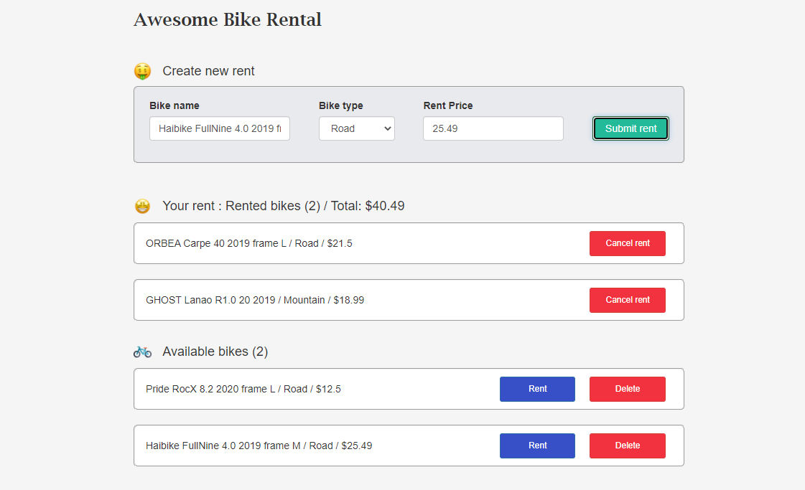

<h2>RentMeApp - Preview</h2>

<h3>Installation tutorial</h3>
<h2>Client</h2>
<ul>
  <li>npm install</li>
  <li>ng serve</li>
</ul>
<h2>Server</h2>
<ul>
  <li>Run server as Kestrel server</li>
</ul>
<h3>Tech. task</h3

SPA must have a form for adding bikes which must contains of fields:

<ul>
  <li>Title - text field</li>
  <li>Type (Road / Mountain) - drop down list</li>
  <li>Rent price - number field</li>
</ul>

Under form for adding bikes must show up two bike lists: "Available bikes" and "Rented bikes".

After clicking on the "Submit rent" the bike must swow up in "Available bikes" list.

User can rent bike from "Available bikes" list. There are two buttons in front of each bike: "Rent" and "Delete".
After clicking on the "Rent" the bike must disappear from "Available bikes" and show up in "Rented bikes".
To end the rent the User must click "Cancel rent" in front of the bike of "Rented bikes" and the bike must be returned to the "Available bikes".

Before each list must show up count of elements inside.

Whole information must be stored on the server in the database and automatically be loaded when the page is reloaded.

Server side must have CRUD operations

Database must have table with bikes. Bike must have all of required fields:

<ul>
  <li>Title</li>
  <li>Type (Road / Mountain)</li>
  <li>Rent price ($)</li>
  <li>Status of the rent (Free / Rented)</li>
</ul>
<ul>Technologies used
    <ul>
      <li>Frontend</li>
        <ul>
          <li>JS (Angular)</li>
          <li>HTML5 + CSS3</li>
          <li>Bootstrap</li>
        </ul>
      <li>Backend</li>
        <ul>
          <li>.NET</li>
          <li>Web API</li>
        </ul>
      <li>Database side</li>
        <ul>
          <li>SQL Server</li>
          <li>Entity Framework</li>
        </ul>
    </ul>
</ul>
